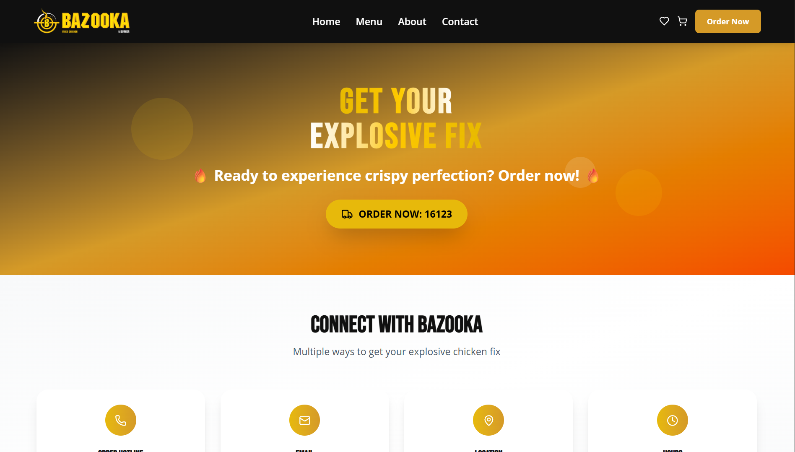
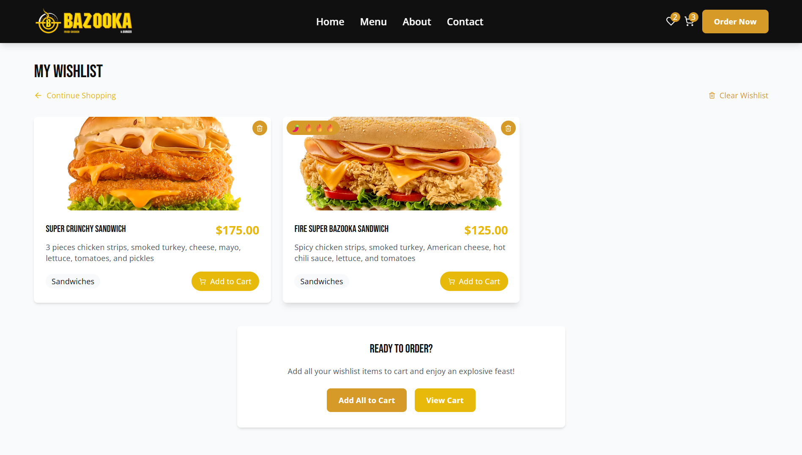
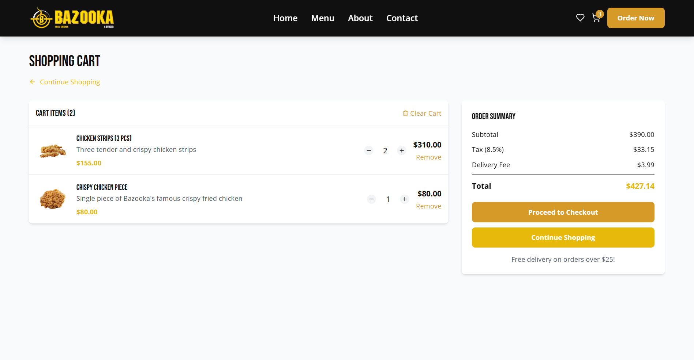

# Bazooka Dynamic Webpage React Project

Full functioning restaurant website for bazooka as a refrence

#### includes:

- Home page

- about page

- contact page
  
    

- menu page
  
    

- search bar

- wishlist
  

- cart

- appility to add to cart, specify amount to be added

- clear cart

- add to wishlist

- mobile responsive
  
  